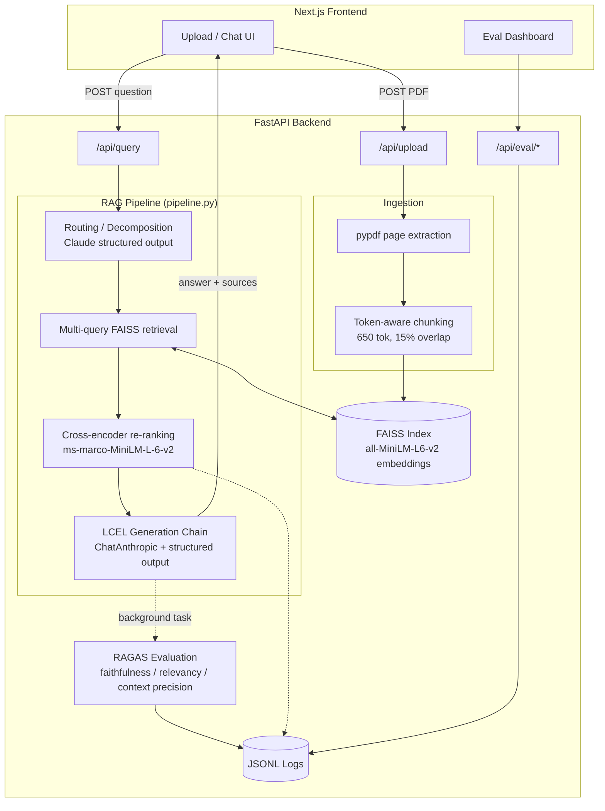

# Research Paper Digest

**Domain chosen (Problem Statement option 7): Research Paper Digest** — upload arXiv-style research papers, ask questions in plain English, and get answers grounded in the paper(s) with page/section citations.

> Phase 1 capstone project, AI Engineering Masters Program. Architecturally equivalent to the reference single-source RAG project (embeddings → FAISS → LCEL chain → query routing/decomposition → cross-encoder re-ranking → RAGAS evaluation), built over a different domain and corpus, with independent implementation decisions documented throughout.

**Submission: Option B — GitHub Repo Only.** See [Deployment](#deployment) for why, and the [Local Development](#setup--local-development) setup below — runnable from a fresh clone in well under 15 minutes.
**Repo:** https://github.com/sunsingh162/research-paper-digest

---

## Overview

A user uploads one or more research paper PDFs (or uses the 3 pre-seeded papers below), asks a question, and gets back a grounded answer with clickable citations pointing to the exact page and section it came from. Every query is scored with [RAGAS](https://github.com/vibrantlabsai/ragas) (faithfulness, answer relevancy, context precision) and logged for inspection in a built-in eval dashboard.

**Seed corpus** (3 real, freely-available arXiv papers — not filler text, fetched via `backend/scripts/fetch_papers.py`):

| Paper | arXiv ID |
|---|---|
| *Attention Is All You Need* | [1706.03762](https://arxiv.org/abs/1706.03762) |
| *BERT: Pre-training of Deep Bidirectional Transformers for Language Understanding* | [1810.04805](https://arxiv.org/abs/1810.04805) |
| *Retrieval-Augmented Generation for Knowledge-Intensive NLP Tasks* | [2005.11401](https://arxiv.org/abs/2005.11401) |

The third paper is thematically apt — it's the origin of the RAG architecture this project implements.

## Architecture



**Design notes:**
- Routing/retrieval/re-ranking are composed as a plain function (`pipeline.py`) feeding into the actual LCEL chain (`ChatPromptTemplate | ChatAnthropic.with_structured_output(...)`) in `generation.py` — each stage has its own side effects (rerank logging) and is independently unit-tested; see `PROGRESS.md` for the full rationale.
- RAGAS scoring runs as a FastAPI background task **after** the answer is returned, not inline — an early measurement showed inline scoring adding ~30s on top of the ~12-15s pipeline itself, which risked the "cited answer within 60 seconds" bar. The score is still logged per query; the frontend polls briefly for it.
- The LLM never authors citation metadata (page/section/snippet) directly — it only names which `chunk_id`s it used; the backend resolves the real metadata from the actual retrieved chunks. This makes every citation mechanically correct by construction rather than trusting the model to reproduce a page number correctly.

## Tech Stack

| Layer | Technology |
|---|---|
| Frontend | Next.js 16 (App Router, Turbopack), React 19, TypeScript, Tailwind CSS v4 |
| Backend | FastAPI, Python 3.11, Pydantic v2 |
| LLM (generation, routing, RAGAS judge) | Anthropic Claude (`claude-haiku-4-5-20251001` by default) via `langchain-anthropic` |
| Embeddings | `sentence-transformers/all-MiniLM-L6-v2`, local, zero-cost |
| Vector store | FAISS (`langchain-community`), `MAX_INNER_PRODUCT` distance over normalized embeddings |
| Re-ranking | `cross-encoder/ms-marco-MiniLM-L-6-v2` via `sentence-transformers.CrossEncoder` |
| Evaluation | RAGAS 0.4.x — faithfulness, answer relevancy, context precision |
| PDF parsing | `pypdf` |
| Chunking | `langchain-text-splitters` `RecursiveCharacterTextSplitter`, token-aware (`tiktoken`) |

## Project Structure

```
backend/
  app/
    main.py              FastAPI app, CORS, lifespan (builds/loads FAISS index at startup)
    config.py             pydantic-settings config
    state.py               In-memory AppState (FAISS store + paper registry)
    routers/               health, papers, upload, query, eval
    models/schemas.py     Pydantic request/response models
    services/
      ingestion.py         PDF -> page-aware chunks
      embeddings.py        Local HuggingFace embeddings
      vectorstore.py       FAISS build/save/load/query
      routing.py            Query classification + decomposition
      retrieval.py          Multi-sub-query retrieval + merge
      reranking.py          Cross-encoder re-ranking + before/after logging
      generation.py         LCEL generation chain
      pipeline.py            End-to-end composition (route -> retrieve -> rerank -> generate)
      evaluation.py          RAGAS scoring + golden-set batch eval
    data/
      papers/               Seed PDFs (fetched, not committed -- see scripts/fetch_papers.py)
      golden_eval_set.json  8 hand-written Q&A pairs for context_precision
    scripts/fetch_papers.py
  storage/                 FAISS index + JSONL logs (gitignored, rebuilt at startup)
frontend/
  app/                     page.tsx (chat), eval/page.tsx (dashboard)
  components/              UploadPanel, ChatWindow, MessageBubble, SourcesPanel, EvalBadge
  lib/api.ts               Typed API client
PROGRESS.md                Running build log with every decision and verification result
```

## Setup — Local Development

### Prerequisites

- Python 3.11+
- Node.js 18+ (Node 24 LTS used in development)
- An [Anthropic API key](https://console.anthropic.com/settings/keys) with available credit

### Backend

```bash
cd backend
python -m venv .venv
source .venv/bin/activate          # Windows: .venv\Scripts\activate
pip install -r requirements.txt

cp .env.example .env               # then edit .env and set ANTHROPIC_API_KEY

python scripts/fetch_papers.py     # downloads the 3 seed PDFs from arXiv

uvicorn app.main:app --port 8000 --reload
```

First startup embeds and indexes the 3 seed papers (a few seconds) and downloads the two HuggingFace models on first run (~100MB combined). Verify: `curl http://localhost:8000/health` should return `{"status":"ok","index_loaded":true,"num_chunks":102,"num_papers":3}`.

### Frontend

```bash
cd frontend
npm install
cp .env.local.example .env.local   # defaults to http://localhost:8000, fine for local dev
npm run dev
```

Open http://localhost:3000 — you should see the 3 seed papers listed and be able to ask a question immediately.

### Troubleshooting

- **`ModuleNotFoundError: _lzma`** on some macOS setups without Homebrew: Python's `lzma` module needs `xz`/liblzma at build time. If you hit this, either install Python via a package manager that bundles it (Homebrew, `pyenv` with Homebrew's `xz` on your `PATH`), or build `xz` from source and rebuild Python against it (see `PROGRESS.md` for the exact steps used during development).
- **`faiss-cpu` import errors**: usually a `numpy` version mismatch with the installed `faiss-cpu` wheel; `pip install "numpy<2"` if you hit this (not needed in this project's tested environment — `faiss-cpu==1.15.0` + `numpy==2.4.6` worked cleanly).
- **CORS errors in the browser**: check `CORS_ORIGINS` in `backend/.env` includes your frontend's actual origin.

## API Reference

| Method | Path | Purpose | Body | Response (key fields) |
|---|---|---|---|---|
| GET | `/health` | Liveness + index status | — | `status, index_loaded, num_chunks, num_papers` |
| GET | `/api/papers` | List ingested papers | — | `[{paper_id, filename, num_pages, num_chunks}]` |
| POST | `/api/upload` | Upload + index a PDF | multipart `file` | `{paper_id, filename, num_pages, num_chunks, status}` |
| POST | `/api/query` | Ask a question | `{question}` | `{query_id, answer, sources[], route_type, sub_queries[], ragas_pending, latency_ms}` |
| POST | `/api/eval/run` | Run the golden Q&A set (all 3 RAGAS metrics) | — | `{aggregate: {faithfulness, answer_relevancy, context_precision, num_items}, per_item[]}` |
| GET | `/api/eval/logs?limit=50` | Tail per-query eval log | — | `[EvalLogEntry]` |
| GET | `/api/eval/rerank-log?limit=20` | Tail re-ranking before/after log | — | `[RerankLogEntry]` |

Interactive Swagger docs available at `/docs` when the backend is running.

## Re-ranking: Before / After Evidence

Query: *"What optimizer and learning rate schedule was used to train the Transformer?"*

| Rank | FAISS (bi-encoder) | Cross-encoder (after re-rank) |
|---|---|---|
| 1 | `attention-is-all-you-need_p8_c0` (score 0.445) | **`attention-is-all-you-need_p7_c1`** (was #3) |
| 2 | `bert-pretraining_p3_c1` (score 0.442) | `attention-is-all-you-need_p8_c1` (was #6) |
| 3 | `attention-is-all-you-need_p7_c1` (score 0.397) | `attention-is-all-you-need_p8_c0` (was #1) |
| 4 | `attention-is-all-you-need_p9_c0` (score 0.385) | `bert-pretraining_p14_c0` (was #5) |
| 5 | `bert-pretraining_p14_c0` (score 0.357) | `bert-pretraining_p3_c1` (**was #2**) |

FAISS's bi-encoder ranked a BERT-paper chunk #2 by surface embedding similarity, even though it's not actually about the Transformer's optimizer — the cross-encoder correctly demotes it to #5, and promotes the chunk that's actually about Adam + the warmup/inverse-square-root learning-rate schedule from #3 to #1. **8 of 9 candidate chunks changed rank.** This was not a cherry-picked result — every one of the ~12 test queries run during development showed substantial reordering (5-19 chunks changed rank each time); full history in `backend/storage/logs/rerank_log.jsonl` and the built-in `/eval` dashboard.

## RAGAS Evaluation

`faithfulness` and `answer_relevancy` (both reference-free) are computed on **every** live query. `context_precision` requires a reference answer, so it's only computed against the hand-written 8-question golden set (`backend/app/data/golden_eval_set.json`, covering all 3 papers including cross-paper questions) via `POST /api/eval/run`.

**Aggregate scores across 2 golden-set runs (16 scored items):**

| Metric | Average |
|---|---|
| Faithfulness | 0.961 |
| Answer Relevancy | 0.681 |
| Context Precision | 0.562 |

Scores are genuinely varied, not uniformly 1.0 — e.g. two questions scored `answer_relevancy = 0.0` because the model honestly answered "the context doesn't fully cover this" rather than guessing (one of them, about BERT's two pretraining task *names*, reveals a real retrieval-coverage gap: the exact task names weren't present in the top-4 reranked chunks for that phrasing of the question). That's the eval pipeline correctly catching an honest partial answer, not a bug — see `PROGRESS.md` for the full investigation.

**Implementation note:** RAGAS's API has changed significantly across recent versions. This project pins `ragas==0.4.3` and uses its newer per-metric async `ascore()` API (`ragas.metrics.collections.{Faithfulness, AnswerRelevancy, ContextPrecisionWithReference}`) rather than the deprecated `evaluate()` function, with `ragas.llms.llm_factory(provider="anthropic")` as the judge LLM. Getting this working against current Claude models required two non-obvious fixes (a dependency pin and a sampling-parameter workaround) — see `PROGRESS.md` and `backend/app/services/evaluation.py`'s module docstring for the full detail, since these are exactly the kind of thing that looks like a config mistake until you've verified otherwise against the live API.

## Known Limitations

- **Section-heading detection is best-effort.** `pypdf`'s text extraction doesn't always preserve reading order in multi-column academic PDFs, so some chunks' `section` metadata is missing or approximate. Page-number citations are always exact (derived from PDF page structure directly, not inferred).
- **Uploaded PDFs are ephemeral in the deployed environment** unless a persistent volume is attached to the backend host — a redeploy resets to just the 3 seed papers. Documented, accepted tradeoff for a low-cost demo deployment (see Deployment below).
- **RAGAS scores are not shown inline** in the chat response — they're computed in a background task and appear a few seconds to ~30s later via polling, to keep the answer itself fast. All scores are still logged per query and visible in the `/eval` dashboard.
- **`langchain-community` is pinned to `0.3.31`**, not the latest, because `ragas==0.4.3` unconditionally imports a module (`langchain_community.chat_models.vertexai`) that was removed in `langchain-community` 0.4.x — a real upstream incompatibility, not a choice. Revisit this pin if upgrading `ragas`.

## Deployment

**This project ships as Option B — GitHub Repo Only**, per the submission guidelines' explicit provision for "projects with heavier local infra... that don't deploy cleanly to a free host." Here's what was actually tried, honestly reported:

- A `Dockerfile` (repo root) and `render.yaml` are included and were used to actually deploy the backend to **Render's free tier**. The build succeeded end-to-end (image built, models baked in, seed PDFs fetched), but the container **crashed on startup with an out-of-memory error (>512Mi)** — PyTorch + `sentence-transformers` alone exceed Render free tier's 512MB RAM ceiling just loading the embedding model, before handling a single request. This is a hard platform limit, not a bug: the same code runs fine locally and would run fine on a paid tier with more RAM (Render Starter, Railway, etc.).
- Rather than add an ongoing paid hosting cost for a course capstone, or risk destabilizing a fully-verified pipeline by swapping to a lighter (ONNX) embedding backend under time pressure, this was scoped down to a repo-only submission — an explicit, honest tradeoff rather than a silent limitation.
- The frontend (Next.js) has no such constraint and would deploy to Vercel's free tier without issue if a memory-sufficient backend host were added later; `frontend/.env.local.example` and `NEXT_PUBLIC_API_BASE_URL` are already structured for that split-deployment setup.
- **If you want to self-host**: `Dockerfile` + `render.yaml` work as-is on any Docker-capable host with ≥1GB RAM (Render Starter, Railway, Fly.io, a VPS). Point Vercel's `NEXT_PUBLIC_API_BASE_URL` at the resulting backend URL and set `CORS_ORIGINS` on the backend to the Vercel domain.

Full investigation (build logs, the exact OOM point, and the decision trail) is in `PROGRESS.md`.
